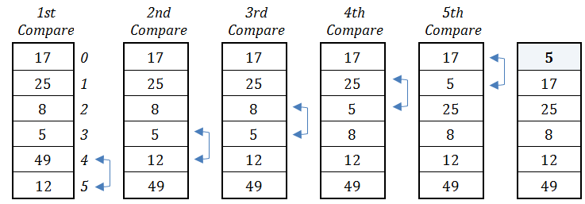

# Algorithms: An Introduction 

In its most basic defintion an algorithm is a set of rules or instructions. Think of a flow chart. That's an algorithm. A cooking reciepe is an algorithm. There are many types of algorithms. 

This repo contains code for some of the more basic and simple algorithms. 

# Bubble Sort 

Bubble sort is the simplest sorting algorithm. It works by repeatedly swapping the adjacent elements if they are in wrong order.

# Measuring An Algorithm's Efficenty